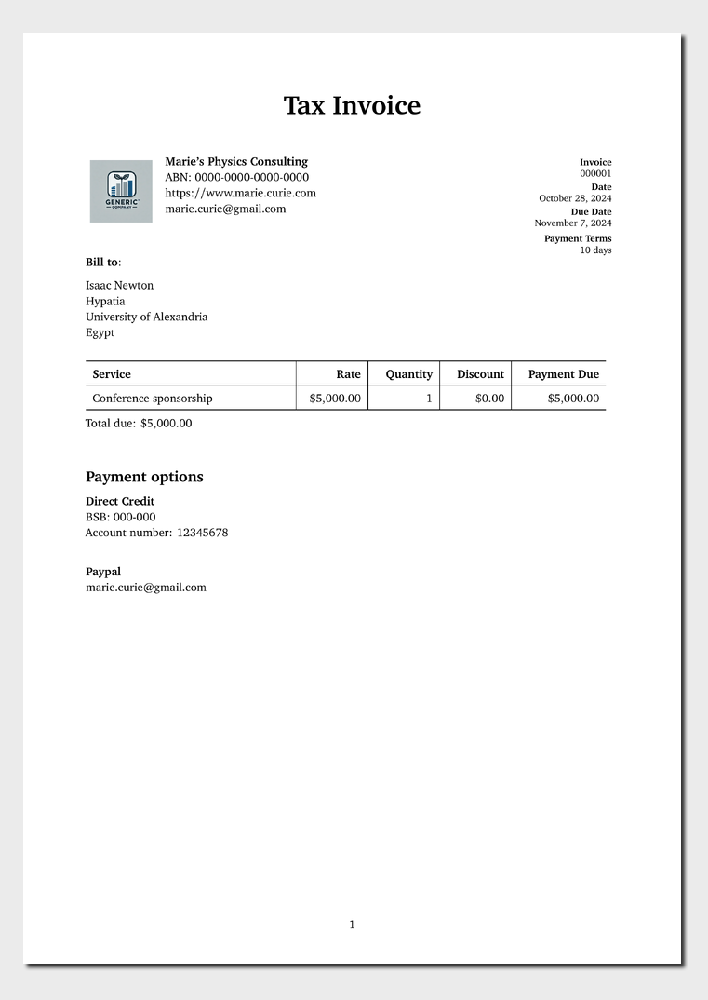

<!-- README.md is generated from README.qmd. Please edit that file -->

# Quarto Invoicing Template

This is a Quarto template to help you generate invoices for your
company. It is based on the standard Australian invoice template.

## Creating a new invoice

You can use this as a template to create an invoice. To do this, use the
following command:

``` bash
quarto use template MikeLydeamore/quarto-invoice
```

This will install the extension and create an example qmd file that you
can use as a starting place for your letter.

## Installation for existing document

You may also use this format with an existing Quarto project or
document. From the quarto project or document directory, run the
following command to install this format:

``` bash
quarto install extension MikeLydeamore/quarto-invoice
```

## Example

[](examples/template.pdf)
